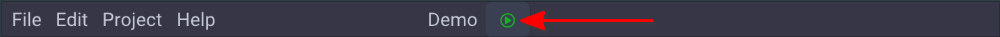
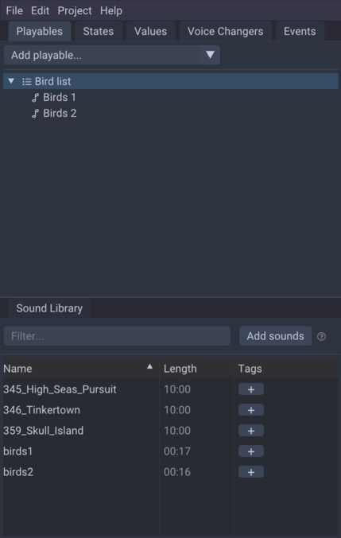

## Getting started
This is a brief how-to guide, that will guide you through setting up a simple project in Bard and familiarize you with the fundamental concepts used in Bard.

You will need a copy of Bard installed on your computer (downloadable from [https://bard.audio](https://bard.audio)), and some audio files. You can find plenty around the internet (eg. [here](https://tabletopaudio.com) or [here](https://freesound.org)). Bard supports .wav, .mp3, .flac, .ogg and a few other common audio formats.

There are a some fundamental concepts to learn in Bard. We'll go through them below, and if you want to follow along you'll end up with a very simple project.

> Text in these boxes indicate something you should do to follow along.

### The basic idea
The fundamental idea with Bard is that you can create rich interactive sound boards that you can *easily* control during a **Live** session. Setting up a project is not necessarily very quick or easy - to begin with at least - but using it during a session should be simple.

This is achieved by throwing in all your audio files, organizing them and setting them up to play in certain ways under certain conditions. You will end up with a sort of control panel with simple buttons and sliders, and when you change them Bard will mix your audio together to create an immersive audioscape.

### How it works
#### Projects
To do anything in Bard you must create a Project. Create one from the `File > New project...` menu.

#### Edit and Live mode
There are two distinct modes that Bard can be in, **Edit** and **Live**. Edit mode is where you - as the name suggests - edit your project and wire all the things up so they fit together nicely. Live mode is what you use when you want to "use" your project, eg. in a D&D session. In this mode all the bells and whistles disappear and you only see the parts of the UI that you set up yourself in Boards (more on Boards later).

You can change between Edit and Live at any time with the little icon next to the project name:

The icon changes and turns red when you're in Live, click it again to go back to Edit.

#### Sounds
When you import audio files into Bard, they are added to your Sound Library panel. You can see various information about the audio file and add tags to help you organize your sounds. You can also "preview" the sound.

> Import your sounds in the Sound Library panel with the "Add sounds" button. You can import multiple files at once.

#### Playables
To use the **Sounds**, you create **Playables**. These are the most important building block when setting up projects. A Playable is anything that can be "played" (surprise!). Most Playables can be nested within each other in a tree-like manner, which allows you to build complex "graphs" of audio. When a Playable is nested within another it is called a "child", and the Playable it is nested within is called its "parent".

There are different types of Playables. They all share a common set of settings such as volume, pitch, looping and **Effects** (more on Effects later), and each type has specific settings.

There are five different types of Playables:

- Sound Playable: The most simple type, it plays a Sound from your Sound Library.
- List Playable: Plays its children in sequence, just like a regular playlist.
- State Playable: Plays a child depending on the current value of a State (more on States next).
- Random Playable: Plays a randomly chosen child.
- Simul Playable: Plays all its children simultaneously.

In the "Playables" panel, you can create a new Playable with the "Add playable..." button. You can then click on the new playable (it will be selected by default) and change its configuration in the "Edit" panel. For a Sound Playable, the most important field to set is the "Sound" field, which determines which Sound from your library to play.

You can play the Playable by click the play button in the "Controls" panel, or press `<space>` on your keyboard.

You can rearrange and nest Playables by dragging them around in the "Playables" panel.

> Try to create two Sound Playables and a List Playable. Set the "Sound" field in each Sound Playable to Sounds from your library. Finally drag the two Sound Playables into the List Playable and play it. It should look something like this:
>
> 

#### States
**States** are like custom dropdown boxes, which you can use to control various elements of a project. First a few example of when **States** can be useful:

- Controlling the ambience: with a **State** called "Weather" with "Rainy", "Thunder", "Sunny" as possible options, for each of those options you can play a specific **Playable** that matches the ambience of the weather.
- Focus: with a **State** called "In Conversation" with "Yes" and "No" as options, you could turn down the volume of all ambience sounds when your party is in conversation, to avoid distraction.
- Combat: with a **State** called "Combat" with "None", "Preparing", "Fighting" and "Heavy" you could play different variations of combat music, and turn down other ambience sounds when combat is anything but "None".

To create a **State**,

#### Values
Values are similar to **States**, but instead of a dropdown like selection, they are numbers. You create **Values** in the "Values" panel, and you can set the minimum and maximum values that the **Value** can take. Use **Values** to describe things like distance, intensity or loudness.

##### Value Links
Various settings of **Playables** (such as volume, pitch and **Effect** settings) can be "linked" to **Values** and **States**. Linking a value means that instead of having one static value, the value can change depending on the linked **Value** or **State**. This is a powerful concept that enables all sorts of ideas.

When you see the **Value Link** icon  next to an input field it means that the field can be **Value Linked**. Drag a **Value** or a **State** onto the icon and then set up the mapping. Click the button again to remove the mapping.

#### Boards
**Boards** are the main thing you'll be using in Live Mode. You can add almost all of the above types of elements to a Board by dragging them onto it. Boards are the interface you make for yourself to control a Live session, and you can organize things in which ever way you want. Maybe it makes sense for you to create a **Board** for each location your story takes place in. Maybe you want one for each type of scene, be it combat, travelling or conversing.

Each type of element displays and functions differently in a **Board**. **Playables** display as a button that will play the **Playable** when clicked. **States** display a dropdown menu in which you select the current value of a **State**.

Note that **Sounds** *cannot* be added to a **Board**, you should instead add a **Sound Playable** with that **Sound** selected.

#### Effects
Effects change the way a **Playable** sounds by applying "filters" to the audio stream. With any **Playable** selected, in "Edit" panel you'll see an "Effects" section. Here you can add one or more **Effects** and change their configuration. These are things like reverb, echo and pitch shifting, and various other types of filters. The best way to create good **Effects** is to just play with it until you find something that sounds right for you.

All of the settings for an **Effect** can use **Value Links**.

#### Voice Changers
**Voice Changers** take input from your microphone and apply **Effects** to it before playing it back on your output device. The **Effects** work exactly like for **Playables**. There is a small latency between the input and output because the effects have to be applied and because of hardware limitations.

Use **Voice Changers** to create voices for characters in your story.

WARNING! If your speakers are close to your microphone (such as when using a laptop without headphones), you will likely create a feedback loop if you try to activate a **Voice Changer***. This can potentially damage your ears or speakers, so please turn down the volume of your speakers and be ready to deactivate the **Voice Changer**, or use headphones.

#### Events
Events are used to group actions you would normally do "manually" into a simple button. For instance, you could have an event called "Enter Dungeon" that sets a state to a certain value, plays an "entrance" sound and changes the active **Board** to one named "Dungeon".
